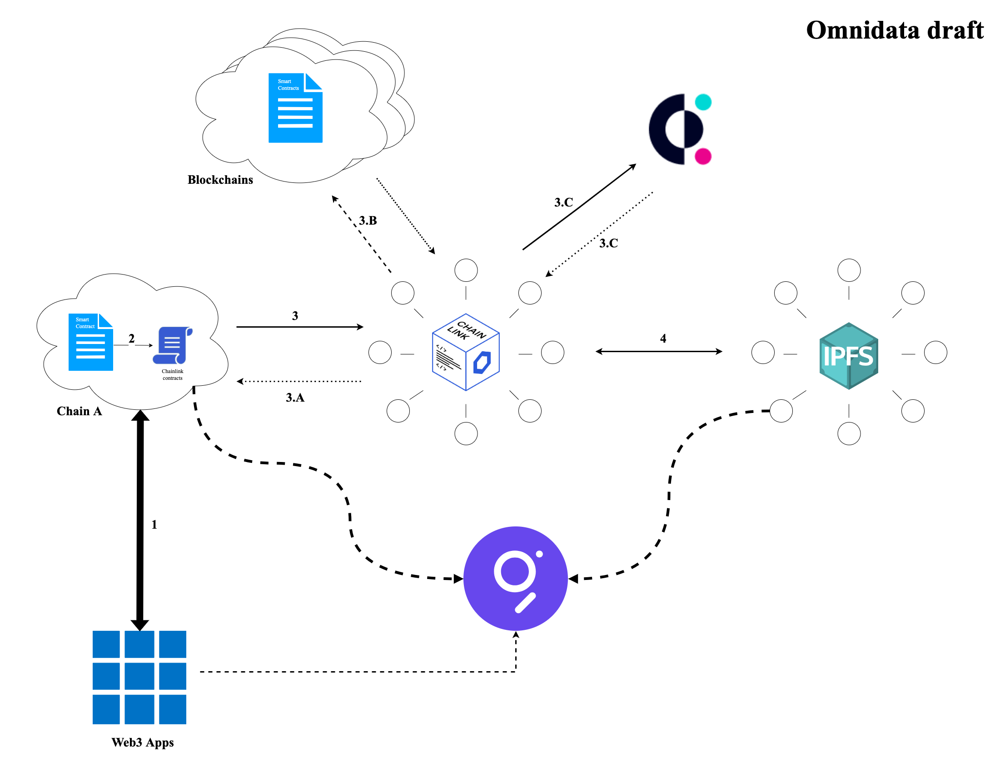
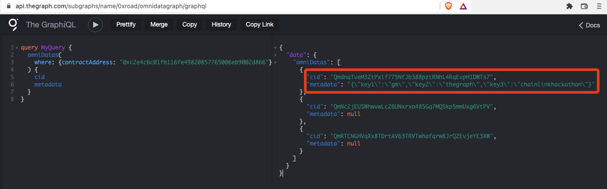
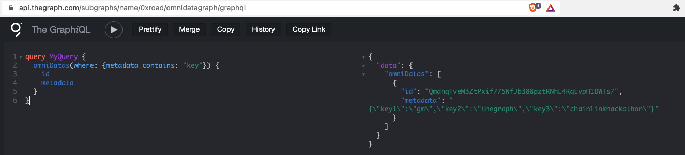

# Omnidata Introduction

This is a wrap up repo, and you'll see the source code in other repositories described below.

We've deployed the contracts to `Kovan`, `Mumbai`, `BSC Testnet`, and `Avalanche FUJI`, which means developers can store the tamper-proof and variable data to `IPFS` via `smart contracts` on any above chains, and they can get the data of any NFT on any blockchain via smart contracts as well. The former one will free the limitations of blocks on-chain, and the latter one will enable all games built on any chain to get all-chain NFT holders on-board without needing to bridge NFTs back and forth.

## What is Omnidata protocol

A chain agnostic decentralized data storage, bridging, and aggregation protocol built for web3 builders to store and query tamper-proof, verifiable, and sovereignty data in a cost-effective, secure, and manageable approach. We aim to help web3 developers to build next-gen and more complex web3 applications much easier.

## What Omnidata protocol can do now and next

### Now

1. Access NFT-related data from different blockchains through the smart contract, such as the floor price of the NFT, the trading volume, the current owner, the creator, etc.
    
    > This benefits the NFTfi products needing the latest information on the secured NFTs. It can also help the Game/GameFi products, for example, and if you built a game on Avalanche and wanted to grant or attract some holders of NFTs that were already issued on Ethereum to play your game, then the NFTs don't need to bridge back and forth between the chains just by using our protocol to get whatever the data you want via the smart contract, to reduce the risk of losing some original benefits like access the community discord etc.

2. To synchronize, track and monitor data generated by the dApp on multiple blockchains directly on your dApp UI.

3. Easily retrieve processed and optimized images from decentralized file storage networks such as IPFS and Filecoin.

### Next

1. Build APIs/SDK to let developers easily fetch the tamper-proof, verifiable, and sovereignty data stored to IPFS/Filecoin via Omnidata protocol.

2. Supports document data storage to the Omnidata network.

3. Keep enhancing the current features, and add more dev-friendly features.

## Tech overview

The protocol heavily relies on Chainlink, IPFS, Covalent, and The Graph to bridge, store, and read data across blockchains.

As you can see from this diagram:

and below one shows the data stored on IPFS via Chainlink EA and query

> 

Fulltext search
> 

## Repositories

[Omnidata External Adapter](https://github.com/omnidata-network/omnidata-ea-js/tree/develop/packages/composites/omnidata)

[Omnidata Contracts](https://github.com/omnidata-network/omnidata-protocol)

[Omnidata Subgraph](https://github.com/omnidata-network/omnidata-graph)

[Covalent External Adapter](https://github.com/omnidata-network/omnidata-ea-js/tree/develop/packages/composites/covalent)

[Covalent EA Contracts](https://github.com/omnidata-network/covalent-ea-contract)
